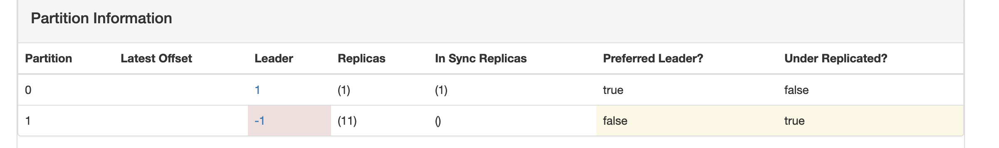

- [kafka官方文档](http://kafka.apachecn.org/documentation.html#introduction)

- 

- kafka topic出现 **Under Replicated Partitions** 问题
    * topic partition情况
    

    * 导致consumer.poll(）一直堵塞，堵塞code：kafka-client:1.0.1  
        
        ```java    
            /** 
            * Block until the provided request future request has finished or the timeout has expired.
            * @param future The request future to wait for
            * @param timeout The maximum duration (in ms) to wait for the request
            * @return true if the future is done, false otherwise
            * @throws WakeupException if {@link #wakeup()} is called from another thread
            * @throws InterruptException if the calling thread is interrupted
            */
            //ConsumerNetworkClient:185L
            public boolean poll(RequestFuture<?> future, long timeout) {
                long begin = time.milliseconds();
                long remaining = timeout;
                long now = begin;
                do {
                    poll(remaining, now, future);
                    now = time.milliseconds();
                    long elapsed = now - begin;
                    remaining = timeout - elapsed;
                } while (!future.isDone() && remaining > 0);
                return future.isDone();
            }

        ```  

    *  debug的exception:   
        `org.apache.kafka.common.errors.LeaderNotAvailableException: There is no leader for this topic-partition as we are in the middle of a leadership election.`

- Kafka Replication
    - Partition 有两种副本：Leader，Follower；
    - Leader 负责维护 in-sync-replicas(ISR)
        * replica.lag.time.max.ms：默认为10000，如果 follower 落后于 leader 的消息数超过这个数值时，leader 就将 follower 从 isr 列表中移除；
        * num.replica.fetchers，默认为1，用于从 leader 同步数据的 fetcher 线程数；
        * min.insync.replica：Producer 端使用来用于保证 Durability（持久性）；

-  Under Replicated Partitions 
    - 当发现 replica 的配置与集群的不同时，一般情况都是集群上的 replica 少于配置数时，可以从以下几个角度来排查问题：
        * JMX 监控: kafka.server:type=ReplicaManagername=UnderReplicatedPartitions；
        * 可能的原因：
            1. Broker 挂了？  (最终发现是broker：11 挂了问题)
            2. Controller 的问题？
            3. zooKeeper 的问题？
            4. Network 的问题？
        * 解决办法：
            1. 调整 ISR 的设置；
            2. Broker 扩容。

- >  Kafka 不是用大多数投票选择 leader 。Kafka 动态维护了一个同步状态的备份的集合 （a set of in-sync replicas）， 简称 ISR ，在这个集合中的节点都是和 leader 保持高度一致的，只有这个集合的成员才 有资格被选举为 leader，一条消息必须被这个集合 所有 节点读取并追加到日志中了，这条消息才能视为提交。这个 ISR 集合发生变化会在 ZooKeeper 持久化，正因为如此，这个集合中的任何一个节点都有资格被选为 leader 。

-  当ISR中的broker节点都挂了，就会导致该partion leader一直选举不出，功能不可用。这个就是导致之前kafka poll消息堵塞的问题所在


- Consumer rebablance   
    * tips:Consumer Coordinator一般指的是运行在broker上的group Coordinator，用于管理Consumer Group中各个成员，每个KafkaServer都有一个GroupCoordinator实例，管理多个消费者组，主要用于offset位移管理和Consumer Rebalance


- kafka broker 在zk metadata存储为hostname，当kafka client连接broker时用 ip直连，会出现produce 超时  和 consume 死循环的问题。


- kafka exactly-one语义：
    * 分为消息交付和消息消费

- kafka 0.9的commit exception:Correlation id for response (2716567) does not match request (2716563)
    * [kafka error jira](https://issues.apache.org/jira/browse/KAFKA-4669)


- kafka的acl
    1. kaka broker(0.11.0.3)配置了acls，开启allow.everyone.if.no.acl.found=true； client进行安全相关config配置
        - client 0.9.0.1: produce fail, 缺少 org.apache.kafka.common.security.plain.PlainLoginModule 相应class
        - client 0.10.0.0: produce success


    2. kaka broker(0.11.0.3)配置了acls，关闭allow.everyone.if.no.acl.found=false；client去除安全相关config项
        - client 0.9.0.1: produce fail：Failed to update metadata after 60000 ms
        - client 0.10.0.0: produce fail：Failed to update metadata after 60000 ms


- kafka的commit error： [官方的issues](https://issues.apache.org/jira/browse/KAFKA-4246),异常日志误导人，害我调了半天的**max.poll.interval.ms** ，**max.poll.records**
    1. 这个问题后来又有遇到，场景是 先是consumer.subcribe(topic)后，用的同一个groupId,之后新起一个consumer去assign，在pollOnce中，一个commit callback中，打出来log.error；
    2. client端异常:
        ```java
        ConsumerCoordinator.java:792
        private class DefaultOffsetCommitCallback implements OffsetCommitCallback {
                @Override
                public void onComplete(Map<TopicPartition, OffsetAndMetadata> offsets, Exception exception) {
                    if (exception != null)
                        log.error("Offset commit with offsets {} failed for group {}", offsets, groupId, exception);
                }
            }
        ```
    3. broker端问题点，`GroupCoordinator.scala doCommitOffsets`,这个方法处；是 同一个group不会空，也不包含assign端memberid，在`!group.has(memberId)`这个if报错了
        ```java
        if (group.is(Dead)) {
           // if the group is marked as dead, it means some other thread has just removed the group
           // from the coordinator metadata; it is likely that the group has migrated to some other
           // coordinator OR the group is in a transient unstable phase. Let the member retry
           // finding the correct coordinator and rejoin.
           responseCallback(offsetMetadata.map { case (k, _) => k -> Errors.COORDINATOR_NOT_AVAILABLE })
         } else if (group.isStaticMemberFenced(memberId, groupInstanceId, "commit-offsets")) {
           responseCallback(offsetMetadata.map { case (k, _) => k -> Errors.FENCED_INSTANCE_ID })
         } else if (generationId < 0 && group.is(Empty)) {
           // The group is only using Kafka to store offsets.
           groupManager.storeOffsets(group, memberId, offsetMetadata, responseCallback)
         } else if (!group.has(memberId)) {
           responseCallback(offsetMetadata.map { case (k, _) => k -> Errors.UNKNOWN_MEMBER_ID })
         } else if (generationId != group.generationId) {
           responseCallback(offsetMetadata.map { case (k, _) => k -> Errors.ILLEGAL_GENERATION })
         } else {
           ...
           ...
         }
        ```


### 12/16 kafka broker重启的消费者问题
1. 第三台broker重启，14:21分，kafka消费者出现下面异常
    - 14:21分，`o.a.k.c.c.i.AbstractCoordinator [AbstractCoordinator.java:652] Marking the coordinator epay-swap2.yq.163.org:9092 (id: 2147483645 rack: null) dead for group datak.hy.group.v1`
        1. 丢数据情况，	order_close_kh
        - 14:35分，用 datak.hy.group.v1重启，在hdfs中14点的数据只到 14.35分
        - 15:04分，用 datak.hy.group.v2重启，数据从lasted开始，14:35-15:04到数据丢失，这个是丢数据的情况
        2. 没有丢数据情况，	order_create_kh
        - 14:35分，用 datak.hy.group.v1重启
        - 15:10分，用 datak.hy.group.v2重启，数据从lasted开始，

        3. 综上，14:21到14:35第一次重启间，其实数据都是继续消费的；14:35-15:05之间从哨兵看消息都是未消费，然后出现不同问题点在，15:05-15:10之间，**15:05的一个操作导致 datak.hy.group.v1 它活了**，v1消费者继续消费，但这时候像order_close_kh已经切到datak.hy.group.v2了，就没消费掉堆积的数据；order_create_kh在15:10分才改成v2重启的，故数据没丢
            - 问题点在 14:35分，用 datak.hy.group.v1重启，kafka 是报错的，
            ```
            2020-12-16 14:35:22,588 INFO [13-1-reader] o.a.k.c.c.i.AbstractCoordinator [AbstractCoordinator.java:652] Marking the coordinator epay-swap2.yq.163.org:9092 (id: 2147483645 rack: null) dead for group datak.hy.group.v1
            2020-12-16 14:35:22,588 ERROR [5-1-reader] o.a.k.c.c.i.ConsumerCoordinator [ConsumerCoordinator.java:685] Offset commit with offsets {datak.transfer.success-2=OffsetAndMetadata{offset=11054916,metadata=''}, datak.transfer.success-1=OffsetAndMetadata{offset=11054915, metadata=''}, datak.transfer.success-0=OffsetAndMetadata{offset=11054915, metadata=''}} failed for group datak.hy.group.v1
            org.apache.kafka.clients.consumer.RetriableCommitFailedException: Offset commit failed with a retriable exception. You should retry committing offsets. The underlying error was: This is not thecorrect coordinator.
            ```
            - [kafka的wiki上相似的issue](https://issues.apache.org/jira/browse/KAFKA-5600)，但这个错在0.11.0.1已经fix了，我们用的是0.11.0.3； 