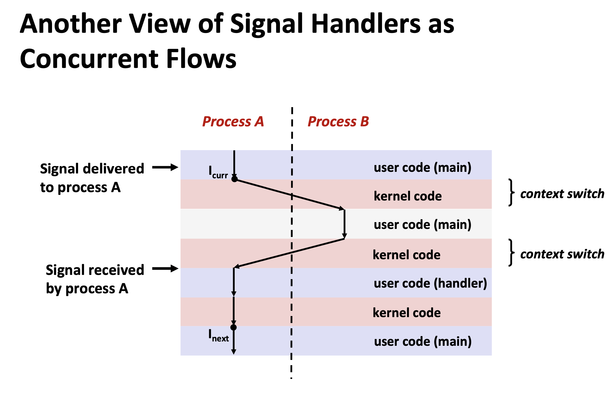
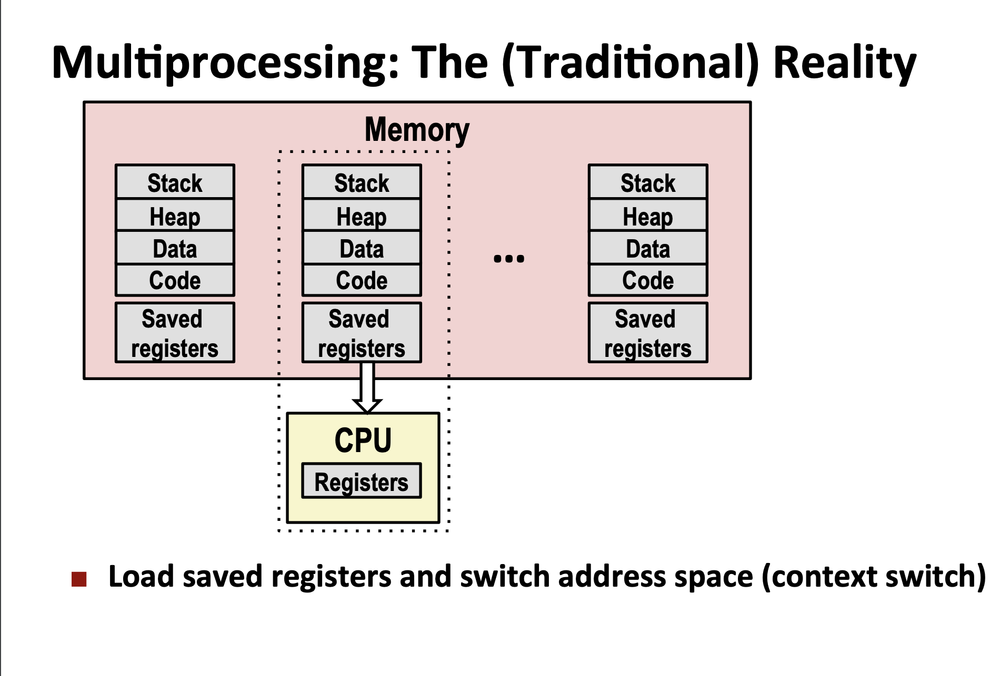

## 1. 计算机中数字表示
- 用二进制表示存储信息，非此即彼，这种两极化表示有很大的容错性。

- int的表示
    - 正数的反码，补码跟原码一致；负数除符号位（第一位1）外取反后是反码，反码+1是补码。
    - 负数的表示是补码形式，是为了统一正负数的+，-运算，还是一个好处是-0 可以表示Int.MIN(java中Integer:MIN_VALUE = 0x80000000)一位的进步。

- float的表示
    - 二进制的科学计数法，一个双精度浮点数所代表的数值为： 
    ${\displaystyle (-1)^{\text{sign}}\times 2^{{\text{exponent}}-{\text{0x3ff}}}\times 1.{\text{mantissa}}}$

## 2. 机器级别编码
- register（寄存器），memory(内存)

- 汇编指令
    * mov
    * lead（load effective address, 加载有效地址）

- 程序执行，stack

## 3. 内存结构
- 内存局限性（locality)
    * 时间局限性(recently)
    * 空间局限性(nearby address)

- 

## 4. singals
- Signals Handlers as Concurrent Flows（信号处理是并发的）

- safe singals handler有一点有点小？？？
    * Declare global variables as volatile： To prevent compiler from storing them in a register
    * 定义volatile防止编译器使用cpu寄存器，但每个process是独占cpu register的,singal handler也是同一个process，也是共享的，所以没必要通过main memory保持一致性啊？？

- 

- 