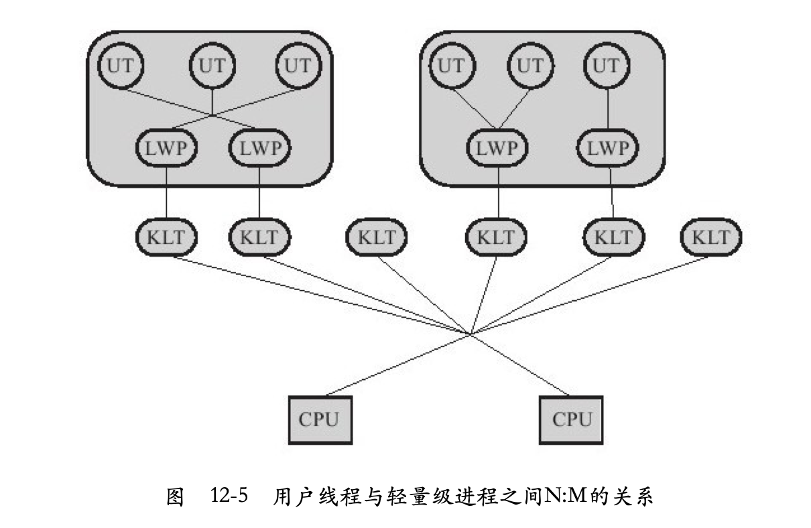
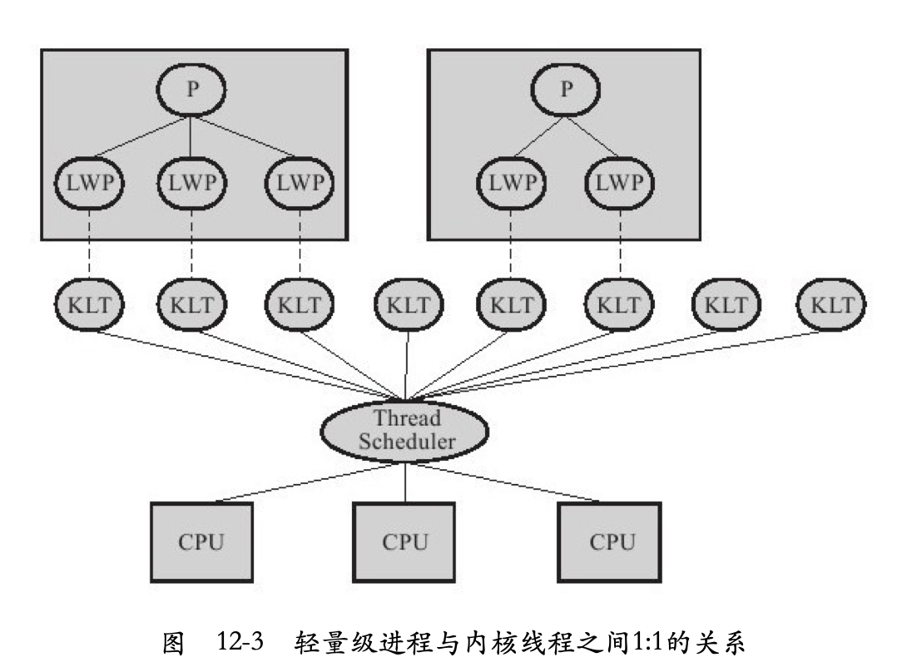

## go的协程

- [The Go scheduler](http://morsmachine.dk/go-scheduler)

- [Analysis of the Go runtime scheduler](../file/12-12-11_DeshpandeSponslerWeiss_GO.pdf)

- 

- 看go中协程还能进行work-stealing

## java中线程实现

- 

